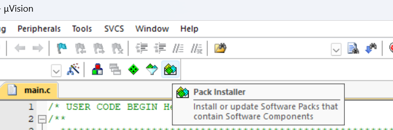

# keil的学习使用

*因为感觉keil的使用过于麻烦，故建立一个文档作为学习备忘*

## 目录
- [keil的学习使用](#keil的学习使用)
  - [目录](#目录)
  - [📘 Keil MDK (μVision) 学习指南：从入门到 STM32 实战](#-keil-mdk-μvision-学习指南从入门到-stm32-实战)
    - [第一部分：基础知识 - 你的“大脑”和“工具”](#第一部分基础知识---你的大脑和工具)
      - [1. 什么是 MCU？](#1-什么是-mcu)
      - [2. MCU 架构 (ARM Cortex-M)](#2-mcu-架构-arm-cortex-m)
      - [3. 什么是 Keil MDK？](#3-什么是-keil-mdk)
    - [第二部分：准备工作 - 安装你的“工具箱”](#第二部分准备工作---安装你的工具箱)
      - [1. 下载和安装 Keil MDK](#1-下载和安装-keil-mdk)
      - [2. 安装芯片支持包 (Pack Installer)](#2-安装芯片支持包-pack-installer)
      - [3. 安装 STM32CubeMX](#3-安装-stm32cubemx)
      - [4. 准备硬件](#4-准备硬件)
    - [第三部分：现代 STM32 开发流程 (CubeMX + Keil)](#第三部分现代-stm32-开发流程-cubemx--keil)
      - [步骤 1：在 STM32CubeMX 中创建项目](#步骤-1在-stm32cubemx-中创建项目)
      - [步骤 2：在 Keil MDK 中打开和编译](#步骤-2在-keil-mdk-中打开和编译)
      - [步骤 3：认识 Keil 界面](#步骤-3认识-keil-界面)
      - [步骤 4：编写你的代码 (点亮 LED)](#步骤-4编写你的代码-点亮-led)
      - [步骤 5：编译和下载](#步骤-5编译和下载)
    - [第四部分：调试 (Debug) 基础](#第四部分调试-debug-基础)
    - [第五部分：重要资源](#第五部分重要资源)


## 📘 Keil MDK (μVision) 学习指南：从入门到 STM32 实战

### 第一部分：基础知识 - 你的“大脑”和“工具”

在开始之前，我们先弄清楚几个基本概念：

#### 1. 什么是 MCU？
**MCU (Microcontroller Unit, 微控制器单元)**，你可以把它想象成一个“微型电脑”。

* **与电脑 CPU 的区别**：你电脑的 CPU (如 Intel i7) 非常强大，但它需要**外部**的内存、硬盘、显卡才能工作。
* **MCU 的特点**：MCU 把 **CPU 核心、内存 (RAM)、存储 (Flash/ROM)、以及各种“工具”（外设**都集成到了一块芯片上。

**STM32** 就是意法半导体 (ST) 公司生产的一个非常流行的 MCU 系列。

#### 2. MCU 架构 (ARM Cortex-M)
“架构”就像是这个“微型电脑”的设计蓝图。

* **8051 架构**：你可能听说过 51 单片机，它使用的是经典的 8051 架构。这是个 8 位架构，就像一个一次只能处理 8 个数据（比如 0-255）的小工人。
* **ARM Cortex-M 架构**：几乎所有的 STM32 芯片都使用 **ARM 公司的 Cortex-M 内核**。
    * **32 位架构**：它是一个 32 位的 RISC (精简指令集) 内核。就像一个一次能处理 32 位数据（一个非常大的数）的强壮工人，效率远超 8051。
    * **标准化**：ARM 只设计这个“大脑”（CPU 核心），然后卖给不同的芯片厂商（如 ST、NXP、TI）。
    * **ST 的角色**：ST 拿来 ARM 的“大脑”，然后给它配上 ST 自己设计的“手脚和工具”（即**外设 Peripherals**），比如：
        * **GPIO**：控制引脚高低电平，用来点灯、读按键。
        * **UART**：用于串口通信（和电脑的 USB 转串口模块通信）。
        * **SPI / I2C**：用于和其他芯片（如传感器）通信。
        * **Timers**：定时器，用于精确计时或输出 PWM 波（控制舵机、电机）。

#### 3. 什么是 Keil MDK？
**Keil MDK (Microcontroller Development Kit)** 就是你用来开发 STM32 的“集成开发环境”(IDE)。

它主要包含几个功能：

1.  **编辑器 (μVision IDE)**：你写 C 语言代码的地方。
2.  **编译器 (ARM Compiler)**：把你写的 C 语言“翻译”成 STM32 (ARM 内核) 能看懂的机器码。
3.  **调试器 (Debugger)**：连接你的下载器 (如 ST-LINK)，让你可以在芯片运行时，实时查看变量、内存，或者让程序单步运行。

---

### 第二部分：准备工作 - 安装你的“工具箱”

#### 1. 下载和安装 Keil MDK
* **官方网站**：前往 ARM Keil 官网 (https://www.keil.com/demo/eval/arm.htm) 下载 MDK-Arm。
* **版本**：下载最新版 MDK v5 即可。
* **许可证**：Keil MDK 是收费软件，但提供了**免费的评估版**。评估版功能齐全，唯一的限制是编译出来的代码**不能超过 32KB**。对于学习 STM32F103 或 F4 系列的入门项目来说，32KB 已经足够用了。

#### 2. 安装芯片支持包 (Pack Installer)
安装完 Keil 后，它还“不认识”STM32。你需要给它装“驱动包”。

1.  打开 Keil MDK (μVision)。
2.  点击菜单栏的 "Pack Installer" 图标（一个带向下箭头的盒子）。
3.  在左侧列表中，找到 `STMicroelectronics` -> `STM32F1xx Series` (如果你用 F103) 或 `STM32F4xx Series` (如果你用 F407)。
4.  在右侧，找到 `Keil::STM32F1xx_DFP` 或 `Keil::STM32F4xx_DFP`。点击它旁边的 "Install" 按钮。
5.  同时，确保 `ARM::CMSIS` 这个核心包也已经安装 (Install)。



#### 3. 安装 STM32CubeMX
在 MDK v5 时代，我们**强烈不推荐**手动配置 STM32 的寄存器或使用旧的“标准库 (SPL)”。

**STM32CubeMX** 是 ST 官方推出的图形化配置工具。你只需要在图形界面上点几下鼠标（比如 "把 PA5 引脚设置成推挽输出"），它就能**自动生成 Keil MDK 项目所需的全部初始化代码 (HAL 库)**。

* **下载地址**：前往 ST 官网 (https://www.st.com/en/development-tools/stm32cubemx.html) 下载。它需要 Java 环境。

#### 4. 准备硬件
1.  一块 STM32 开发板（如 STM32F103C8T6 最小系统板，或 STM32F407 探索者/战舰）。
2.  一个 ST-LINK V2 下载/调试器。
3.  杜邦线和 LED（如果你的板子没有自带 LED）。

---

### 第三部分：现代 STM32 开发流程 (CubeMX + Keil)

这是目前最高效、最标准的入门流程。

#### 步骤 1：在 STM32CubeMX 中创建项目

1.  打开 STM32CubeMX。
2.  **Access to MCU Selector**：选择你的芯片型号，比如 `STM32F103C8T6`。
3.  **Pinout & Configuration (引脚配置)**：
    * **SYS**：在 `Debug` 选项中，选择 `Serial Wire`。**（这一步至关重要，否则芯片只能下载一次程序！）**
    * **RCC**：在 `High Speed Clock (HSE)` 中，选择 `Crystal/Ceramic Resonator` (使用外部晶振)。
    * **GPIO**：找到一个连接了 LED 的引脚（比如 `PC13`），左键点击它，选择 `GPIO_Output`。
4.  **Clock Configuration (时钟树配置)**：
    * CubeMX 通常会自动帮你配置好时钟树（比如 72MHz）。你只需确保没有红色错误提示即可。
5.  **Project Manager (项目管理)**：
    * **Project Name**：给你的项目起个名字 (如 `Blinky`)。
    * **Project Location**：选择一个存放项目的**全英文路径**。
    * **Toolchain / IDE**：在下拉菜单中，**选择 `MDK-ARM`**。
    * **[重要] Code Generator (代码生成器)**：勾选 "Generate peripheral initialization as a pair of '.c/.h' files per peripheral" (按外设生成 .c/.h 文件)，这样项目结构更清晰。
6.  **GENERATE CODE**：点击右上角的 "GENERATE CODE"。

#### 步骤 2：在 Keil MDK 中打开和编译

1.  进入你刚才保存项目的文件夹 (如 `Blinky`)。
2.  找到 `MDK-ARM` 文件夹。
3.  双击 `.uvprojx` 后缀的文件 (如 `Blinky.uvprojx`)，Keil MDK 就会自动打开这个项目。

#### 步骤 3：认识 Keil 界面

* **[图片资源] Keil MDK 主界面：**
    ``

1.  **左侧 (Project Window)**：这是你的项目文件树。CubeMX 已经帮你分好了组：
    * `Application/MDK-ARM`：包含启动文件 `startup_stm32f103c8tx.s`。
    * `Application/User`：**这是你写代码的地方！** 主要是 `main.c`。
    * `Drivers/STM32F1xx_HAL_Driver`：ST 官方的 HAL 驱动库文件。
    * `Drivers/CMSIS`：ARM 的核心驱动文件。
2.  **中间 (Editor Window)**：写代码的区域。
3.  **下方 (Build Output Window)**：显示编译信息、警告和错误。

#### 步骤 4：编写你的代码 (点亮 LED)

1.  在左侧项目窗口，展开 `Application/User`，双击 `main.c` 打开它。
2.  **千万不要**在 `main()` 函数的开头写代码。
3.  滚动 `main.c`，找到 `while(1)` 循环。
4.  你会看到类似这样的注释：

    ```c
    /* USER CODE BEGIN WHILE */
    while (1)
    {
      /* USER CODE END WHILE */
  
      /* USER CODE BEGIN 3 */
    }
    /* USER CODE END 3 */
    ```

5.  **你所有的 `while` 循环代码都必须写在 `BEGIN` 和 `END` 注释之间！** 否则，你下次用 CubeMX 重新生成代码时，你写的代码会被覆盖掉。

6.  在 `/* USER CODE BEGIN 3 */` 和 `/* USER CODE END 3 */` 之间，添加以下“点灯”代码（假设你的 LED 在 PC13 引脚）：

    ```c
    HAL_GPIO_TogglePin(GPIOC, GPIO_PIN_13); // 翻转 PC13 引脚电平
    HAL_Delay(500);                        // 延时 500 毫秒
    ```

    * `HAL_GPIO_TogglePin`：HAL 库函数，用于翻转引脚电平。
    * `HAL_Delay`：HAL 库函数，用于毫秒级延时。

#### 步骤 5：编译和下载

1.  **配置调试器 (ST-LINK)**：
    * 点击菜单栏上的“魔术棒”图标 (Options for Target)。
    * 切换到 **Debug** 标签页。
    * 在右上角的下拉菜单中，选择 **ST-Link Debugger**。
    * 点击旁边的 **Settings** 按钮：
        * 在 **Flash Download** 标签页，勾选 **Reset and Run**。（这样下载完程序后芯片会自动重启运行）。
    * 点击 OK 保存退出。
2.  **编译 (Build)**：
    * 点击菜单栏的 "Build" 按钮（快捷键 F7）。
    * 观察下方的 "Build Output" 窗口，确保最后显示 **"0 Error(s), 0 Warning(s)"**。
3.  **下载 (Download)**：
    * 确保你的 ST-LINK 和开发板已连接好。
    * 点击菜单栏的 "Load" 按钮（快捷键 F8）。
    * 如果一切正常，你会看到 "Flash Download finished" 的提示。

此时，你开发板上的 LED 应该已经开始以 0.5 秒的间隔闪烁了！

---

### 第四部分：调试 (Debug) 基础

调试是 Keil 最强大的功能，也是你必须学会的技能。

1.  **开始调试**：点击 "Build" 和 "Load" 按钮旁边的**红色 'd' 图标** (Start/Stop Debug Session)，或者按快捷键 `Ctrl + F5`。
2.  Keil 的界面会发生变化，进入调试视图。
3.  **常用调试操作**：
    * **Run (F5)**：全速运行代码。
    * **Stop**：暂停代码运行。
    * **Step Over (F10)**：**单步执行**。如果遇到函数，它会把函数当做一步执行完，不会跳进去。
    * **Step Into (F11)**：**单步进入**。如果遇到函数，它会跳进函数内部执行。
    * **Run to Cursor Line (Ctrl+F10)**：运行到你光标所在的那一行。
    * **Set Breakpoint (F9)**：在代码行号旁边点击，设置一个**断点**。程序运行到这里时会自动暂停。
4.  **常用调试窗口**：
    * **Watch 1 / Watch 2**：可以输入你的变量名（比如 `a`），实时查看它的值。
    * **Call Stack**：显示函数的调用堆栈。
    * **(最有用) Peripherals (外设)**：在菜单栏 `View` -> `System Viewer` 中，你可以找到并打开 `GPIO`、`TIM`、`UART` 等窗口，**实时查看 STM32 芯片内部寄存器的状态！**

---

### 第五部分：重要资源

1.  **Keil 官方文档**：(https://www.keil.com/support/man/docs/uv4/) 官方手册，非常详细。
2.  **ST 官网**：(https://www.st.com) 你需要在这里下载：
    * **STM32CubeMX**
    * **STM32F103 的数据手册 (Datasheet)**：查看引脚定义、电气特性。
    * **STM32F103 的参考手册 (Reference Manual, RM)**：**（最重要）** 查看所有外设（如 GPIO, UART）的寄存器级详细说明。
3.  **视频教程**：
    * **Bilibili (B 站)**：搜索 "STM32 Keil 教程" 或 "STM32CubeMX 教程"，有海量的中文视频，比如正点原子、野火等机构的免费课程都非常好。

希望这份指南对你入门 Keil 和 STM32 有所帮助！