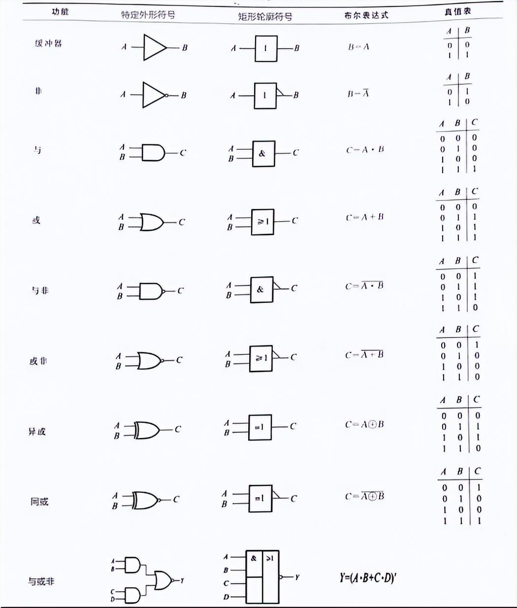
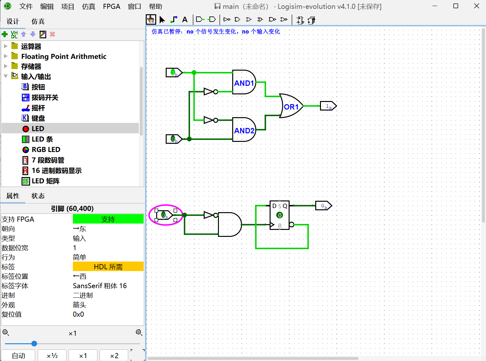

# F阶段
- [F阶段](#f阶段)
- [F2-Logisim](#f2-logisim)
    - [1.了解Logisim](#1了解logisim)
      - [基本逻辑门符号对照表](#基本逻辑门符号对照表)
      - [完成的作业](#完成的作业)

# F2-Logisim

### 1.了解Logisim

#### 基本逻辑门符号对照表

~~忘光光了，附上表格方便脑雾的时候查阅~~

#### 完成的作业

**1.测试电路&单步模式**

