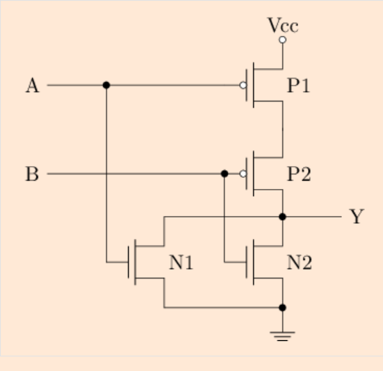

# F阶段
- [F阶段](#f阶段)
- [F2-Logisim](#f2-logisim)
    - [1.了解Logisim](#1了解logisim)
      - [基本逻辑门符号对照表](#基本逻辑门符号对照表)
      - [完成的作业](#完成的作业)
- [F3-数字逻辑电路基础](#f3-数字逻辑电路基础)

# F2-Logisim

### 1.了解Logisim

#### 基本逻辑门符号对照表

~~忘光光了，附上表格方便脑雾的时候查阅~~

#### 完成的作业

**1.测试电路&单步模式**

# F3-数字逻辑电路基础

**验证该逻辑功能：**

| A |B| P1 | P2 | N1 | N2 | Y |
| :---: | :---: | :---: |:---: | :---: | :---: |:---: |
|0|0|通|通|关|关|1|
|0|1|通|关|关|通|0|
|1|0|关|通|通|关|0|
|1|1|关|关|通|通|0|

综上可见：该电路实现或非门

若要实现或门，在上图或非门输出部分加上一个CMMOS电路即可

