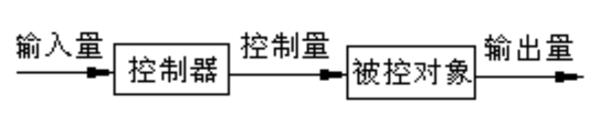
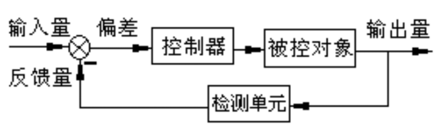
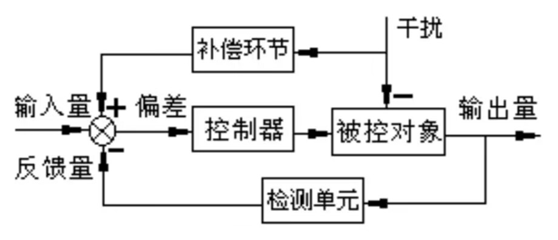
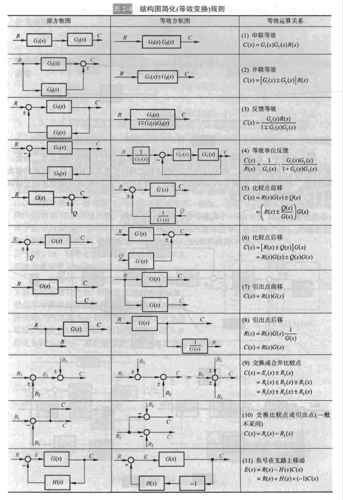
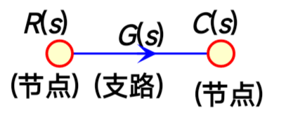
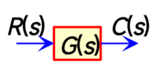
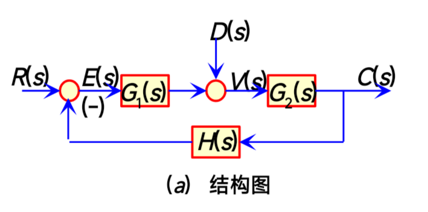
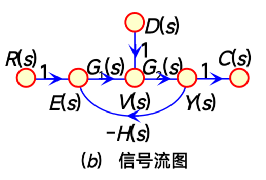
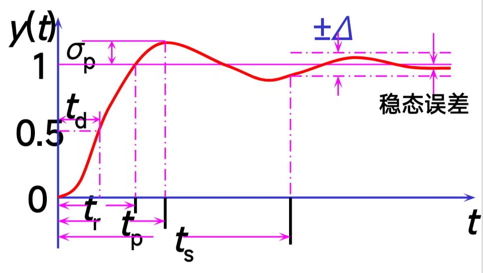

# 自动控制原理的笔记

~~先放在这里，如果真的开始记了就删掉这句~~

## 目录

- [自动控制原理的笔记](#自动控制原理的笔记)
  - [目录](#目录)
  - [1.自动控制系统的基本控制方式](#1自动控制系统的基本控制方式)
    - [1.1开环控制](#11开环控制)
    - [2.2闭环控制](#22闭环控制)
    - [1.3复合控制](#13复合控制)
  - [2.控制系统的数学模型](#2控制系统的数学模型)
    - [2.1傅里叶变换与拉普拉斯变换](#21傅里叶变换与拉普拉斯变换)
      - [拉普拉斯变换的本质](#拉普拉斯变换的本质)
      - [**拉普拉斯变换对照表**](#拉普拉斯变换对照表)
      - [重要性质与定理](#重要性质与定理)
    - [2.2传递函数](#22传递函数)
      - [什么是传递函数？](#什么是传递函数)
      - [传递函数的物理意义和作用](#传递函数的物理意义和作用)
    - [2.3如何求传递函数？](#23如何求传递函数)
    - [总结](#总结)
  - [3.动态结构图的等效变换](#3动态结构图的等效变换)
  - [4.信号流图与梅逊公式](#4信号流图与梅逊公式)
    - [4.1 信号流图的基本性质](#41-信号流图的基本性质)
    - [4.2 核心术语 (Key Terminology)](#42-核心术语-key-terminology)
    - [4.3 信号流图的绘制](#43-信号流图的绘制)
    - [4.4 梅森增益公式 (Mason's Gain Formula)](#44-梅森增益公式-masons-gain-formula)
      - [计算步骤（Step-by-Step）](#计算步骤step-by-step)
  - [5.线性系统的时域分析法](#5线性系统的时域分析法)
    - [5.1动态和稳态性能指标](#51动态和稳态性能指标)
      - [动态性能指标](#动态性能指标)
      - [稳态性能指标](#稳态性能指标)
    - [5.2 一阶系统的时域分析](#52-一阶系统的时域分析)
      - [(a) 一阶系统的单位脉冲响应](#a-一阶系统的单位脉冲响应)
      - [(b) 一阶系统的单位阶跃响应](#b-一阶系统的单位阶跃响应)
      - [(c) 稳态误差分析 (Steady-State Error)](#c-稳态误差分析-steady-state-error)
    - [本章 题型解法总结](#本章-题型解法总结)
      - [题型一：求解动态性能指标 ($\\sigma%, t\_s, t\_p, t\_r$)](#题型一求解动态性能指标-sigma-t_s-t_p-t_r)
      - [题型二：判断系统稳定性 (劳斯判据)](#题型二判断系统稳定性-劳斯判据)
      - [题型三：求解稳态误差 ($e\_{ss}$)](#题型三求解稳态误差-e_ss)

---

## 1.自动控制系统的基本控制方式

**自动控制系统的定义**：为自动达到某一目的，由相互制约的各个部分按一定规律组织成的、具有一定功能的整体。

自动控制系统的组成：**控制器、被控对象、反馈环节、中间环节**等。

自动控制系统基本控制方式：**开环控制**、**闭环控制**和**复合控制**三种。

### 1.1开环控制

特点：控制器与被控对象之间只有正向控制作用而没有反馈作用，简单、控制精度低。

### 2.2闭环控制

  
**负反馈：偏差量=输入量-反馈量**

特点：
* 控制精度高，稳定性好
* 对反馈设备要求高，价格贵，系统结构复杂

### 1.3复合控制

干扰补偿的开环控制和按偏差的闭环控制相结合

---

## 2.控制系统的数学模型

### 2.1傅里叶变换与拉普拉斯变换

**为什么从傅里叶变换转向拉普拉斯变换？**

在信号处理和系统分析的早期，傅里叶变换（Fourier Transform）是一个极其强大的工具。它能将一个复杂的时域信号分解成一系列不同频率的正弦波，让我们能在频域中分析信号的特性。然而，在自动控制领域，傅里-叶变换有几个关键的局限性，而拉普拉斯变换（Laplace Transform）恰好解决了这些问题。

**傅里叶变换的核心局限：**

1.  **收敛条件的严苛性**：傅里叶变换要求信号在整个时间轴上是“绝对可积”的（即 $\int_{-\infty}^{\infty} |f(t)| dt < \infty$）。这意味着，只有那些随着时间推移，幅值最终会衰减到零的稳定信号才能进行傅里-叶变换。但在控制系统中，我们经常会遇到两类不满足此条件的信号：
    * **阶跃信号 (Step Function)**：例如，一个系统启动时，输入信号从0突然变为1并保持不变。这种信号显然不是绝对可积的。
    * **发散信号**：在一个不稳定的系统中，输出可能会随时间无限增大（如 $e^{at}$，其中 $a>0$）。这类信号也无法进行傅里-叶变换。

2.  **无法分析系统稳定性**：傅里叶变换主要分析的是系统的**稳态响应**，即系统在运行了足够长时间后，对持续输入（如正弦波）的反应。它无法直接告诉我们系统的**暂态响应**（系统在刚受到输入信号时的初始反应）以及系统的**稳定性**（系统在受到扰动后是趋于稳定还是发散）。而对于控制系统设计来说，保证稳定性是首要任务。

3.  **对初始条件处理不便**：在解决微分方程时，系统的初始状态（如电容的初始电压、弹簧的初始位移）至关重要。傅里-叶变换在处理这些非零初始条件时非常不方便。

**拉普拉斯变换的优势：**

为了克服这些局限，拉普拉斯变换被引入。可以将拉普拉斯变换看作是傅里叶变换的“增强版”或“推广版”。

它的定义为：

$$
F(s) = \mathcal{L}[f(t)] = \int_{0}^{\infty} f(t)e^{-st} dt
$$

这里的关键是复变量 $s = \sigma + j\omega$。

1.  **引入衰减因子，放宽收敛条件**：
    * $s$ 中的实部 $\sigma$ 起到了一个**衰减因子**的作用。在积分中乘以 $$e^{-st} = e^{-(\sigma+j\omega)t} = e^{-\sigma t}e^{-j\omega t}$$ 其中的 $e^{-\sigma t}$ 项可以强制一个原本发散的函数（如 $e^{at}$）收敛。只要我们选择一个足够大的 $\sigma$（ $\sigma > a$ ），就可以让乘积 $f(t)e^{-\sigma t}$ 变得绝对可积，从而保证积分能够收敛。
    * 这就意味着，即便是阶跃信号、斜坡信号甚至某些指数增长的信号，只要在一定的 $\sigma$ 取值范围内，都可以进行拉普拉斯变换。这个范围被称为**收敛域 (Region of Convergence, ROC)**。

2.  **统一分析暂态与稳态，并判断稳定性**：
    * 复频率 $s$ 所在的复平面（s平面）成为了分析系统特性的强大工具。系统的传递函数 $H(s)$ 的**极点**（使 $H(s)$ 变为无穷大的 $s$ 值）在s平面上的位置直接决定了系统的性能。
    >* **稳定性判断**：如果所有极点都位于s平面的左半边（即实部 $\sigma < 0$），则系统是稳定的。只要有一个极点位于右半边，系统就是不稳定的。这是拉普拉斯变换在控制理论中最核心的应用之一。 
      

3.  **方便处理初始条件**：拉普拉斯变换的微分定理 $\mathcal{L}[f'(t)] = sF(s) - f(0)$，很自然地将时域中的初始条件 $f(0)$ 包含进了频域的代数方程中，使得求解微分方程变得异常简洁。

**总结一下**：从傅里叶变换到拉普拉斯变换，本质上是为了将分析的信号范围从**稳定的、能量有限的信号**扩展到**更广泛的、可能发散的、有初始条件的工程信号**，并且提供了一个能够同时分析系统暂态、稳态和稳定性的统一框架。

---

#### 拉普拉斯变换的本质

拉普拉斯变换的本质可以理解为：**将一个定义在时域上的函数（通常是微分方程），映射到一个定义在复频域（s域）上的代数方程。**

这个过程的核心思想与傅里-叶变换类似，都是一种**基变换**。

* **傅里叶变换**：将信号分解为一系列具有不同频率 $\omega$ 的、永不衰减的虚指数函数 $e^{j\omega t}$（即正弦和余弦波）的线性组合。它的“基”是 
  
  $$\{e^{j\omega t} | \omega \in (-\infty, \infty)\}$$

* **拉普拉斯变换**：将信号分解为一系列具有不同复频率 $s = \sigma + j\omega$ 的、**可能衰减或增长**的虚指数函数 $e^{st}$ 的线性组合。它的“基”是 
  
  $$\{e^{st} | s \in \mathbb{C}\}$$

$$e^{st} = e^{(\sigma+j\omega)t} = e^{\sigma t}e^{j\omega t} = e^{\sigma t}(\cos(\omega t) + j\sin(\omega t))$$

这个“基”既包含了振荡特性（由 $\omega$ 决定），也包含了衰减或增长的包络特性（由 $\sigma$ 决定）。因此，拉普拉斯变换能够描述和分析比傅里叶变换更复杂的动态行为，这正是控制系统所需要的。

**一句话概括其本质**：拉普拉斯变换通过一个巧妙的积分变换，将复杂的“微积分运算”（微分和积分）转换为了简单的“代数运算”（乘除和加减），极大地简化了动态系统的分析和求解过程。

---

 #### **拉普拉斯变换对照表**

| 序号 | **原函数 (时域) f(t)** | **象函数 (s域) F(s)** | **说明** |
| :--- | :--- | :--- | :--- |
| 1 | $\delta(t)$ | $1$ | 单位冲激函数 |
| 2 | $u(t)$ | $\frac{1}{s}$ | 单位阶跃函数 |
| 3 | $t \cdot u(t)$ | $\frac{1}{s^2}$ | 单位斜坡函数 |
| 4 | $t^n \cdot u(t)$ (n为正整数) | $\frac{n!}{s^{n+1}}$ | 幂函数 |
| 5 | $e^{-at} \cdot u(t)$ | $\frac{1}{s+a}$ | 指数衰减函数 |
| 6 | $t \cdot e^{-at} \cdot u(t)$ | $\frac{1}{(s+a)^2}$ | |
| 7 | $t^n \cdot e^{-at} \cdot u(t)$ (n为正整数) | $\frac{n!}{(s+a)^{n+1}}$ | |
| 8 | $\sin(\omega t) \cdot u(t)$ | $\frac{\omega}{s^2 + \omega^2}$ | 正弦函数 |
| 9 | $\cos(\omega t) \cdot u(t)$ | $\frac{s}{s^2 + \omega^2}$ | 余弦函数 |
| 10 | $e^{-at}\sin(\omega t) \cdot u(t)$ | $\frac{\omega}{(s+a)^2 + \omega^2}$ | 衰减正弦 |
| 11 | $e^{-at}\cos(\omega t) \cdot u(t)$ | $\frac{s+a}{(s+a)^2 + \omega^2}$ | 衰减余弦 |
| 12 | $\sinh(at) \cdot u(t)$ | $\frac{a}{s^2 - a^2}$ | 双曲正弦 |
| 13 | $\cosh(at) \cdot u(t)$ | $\frac{s}{s^2 - a^2}$ | 双曲余弦 |
| 14 | $1 - e^{-at}$ | $\frac{a}{s(s+a)}$ | 一阶系统阶跃响应 |
| 15 | $\frac{1}{\tau} e^{-t/\tau}$ | $\frac{1}{\tau s + 1}$ | 典型一阶惯性环节 |
| 16 | $\omega_n^2 e^{-\zeta\omega_n t} \sin(\omega_d t)$   $\omega_d = \omega_n\sqrt{1-\zeta^2}$ | $\frac{\omega_n^2}{s^2+2\zeta\omega_n s+\omega_n^2}$ | 典型二阶欠阻尼系统 |

注：$u(t)$即1(t),通常可省略。

---

#### 重要性质与定理

| 性质/定理 | 时域运算 $f(t)$ | s域运算 $F(s)$ |
| :--- | :--- | :--- |
| **线性性质** | $a f_1(t) + b f_2(t)$ | $a F_1(s) + b F_2(s)$ |
| **时移性质** | $f(t-t_0)u(t-t_0)$ | $e^{-st_0}F(s)$ |
| **复频移性质** | $e^{-at}f(t)$ | $F(s+a)$ |
| **尺度变换** | $f(at)$, $a>0$ | $\frac{1}{a}F(\frac{s}{a})$ |
| **时域微分定理** | $\frac{df(t)}{dt}$ | $sF(s) - f(0^-)$ |
| | $\frac{d^n f(t)}{dt^n}$ | $s^n F(s) - \sum_{k=1}^{n} s^{n-k} f^{(k-1)}(0^-)$ |
| **时域积分定理** | $\int_0^t f(\tau) d\tau$ | $\frac{F(s)}{s}$ |
| **s域微分定理** | $(-t)f(t)$ | $\frac{dF(s)}{ds}$ |
| | $(-t)^n f(t)$ | $\frac{d^n F(s)}{ds^n}$ |
| **s域积分定理** | $\frac{f(t)}{t}$ | $\int_s^\infty F(\sigma) d\sigma$ |
| **卷积定理** | $f_1(t) * f_2(t) = \int_0^t f_1(\tau)f_2(t-\tau)d\tau$ | $F_1(s) \cdot F_2(s)$ |
| **初值定理** | $f(0^+) = \lim_{t\to 0^+} f(t)$ | $\lim_{s\to\infty} sF(s)$ |
| **终值定理** | $f(\infty) = \lim_{t\to\infty} f(t)$ | $\lim_{s\to 0} sF(s)$ (仅当系统稳定时) |

---

### 2.2传递函数

#### 什么是传递函数？

**1. 核心定义**

传递函数是描述**线性时不变 (Linear Time-Invariant, LTI) 系统**动态特性的数学模型。它定义为：

> **在零初始条件下，系统输出信号的拉普拉斯变换与输入信号的拉普拉斯变换之比。**

用数学公式表示为：

$$
G(s) = \frac{Y(s)}{U(s)}
$$

其中：
* $G(s)$ 是传递函数。
* $Y(s)$ 是系统输出信号 $y(t)$ 的拉普拉斯变换。
* $U(s)$ 是系统输入信号 $u(t)$ 的拉普拉斯变换。
* $s$ 是复变量，即 $s = \sigma + j\omega$。

**关键点解读**

* **线性时不变系统 (LTI)**：这是传递函数应用的前提。
    * **线性 (Linear)**：系统满足叠加原理。如果输入 $u_1(t)$ 产生输出 $y_1(t)$，输入 $u_2(t)$ 产生输出 $y_2(t)$，那么输入 $a \cdot u_1(t) + b \cdot u_2(t)$ 必然产生输出 $a \cdot y_1(t) + b \cdot y_2(t)$。
    * **时不变 (Time-Invariant)**：系统的特性不随时间变化。今天对系统施加一个输入信号得到的响应，和明天施加同样的输入得到的响应，除了时间起点不同，响应的形态是完全一样的。

* **零初始条件 (Zero Initial Conditions)**：这是定义的另一个关键前提。在分析传递函数时，我们假设系统在输入信号作用之前处于完全静止的状态。这样做是为了**将系统的响应完全归因于输入信号**，从而分离出系统本身的固有特性。

* **s域模型**：传递函数是定义在复频域（s域）中的，而不是时域。它把描述系统的时域**微分方程**转换为了s域的**代数方程**，极大地简化了分析和计算。

---

#### 传递函数的物理意义和作用

**1. 描述系统自身的固有特性**

传递函数 $G(s)$ 只与系统自身的**结构和参数**有关，而与**输入信号的形式和大小无关**。你可以把传递函数想象成一个系统的“指纹”或“DNA”，它揭示了系统内部的动态规律。

**2. 揭示系统的动态性能**

通过分析传递函数的**极点**和**零点**来预判系统性能。

* **极点 (Poles)**：使传递函数 $G(s)$ 的**分母多项式**为零的 $s$ 值。
    * **极点的位置直接决定了系统的稳定性和响应模式**。
        * **极点在s平面的左半平面**：系统是**稳定**的。
        * **极点在s平面的虚轴上**：系统处于**临界稳定**状态。
        * **极点在s平面的右半平面**：系统是**不稳定**的。

* **零点 (Zeros)**：使传递函数 $G(s)$ 的分子多项式为零的 $s$ 值。
    * **零点影响系统响应的形态和幅值**，但**不影响系统的稳定性**。

**3. 简化系统分析**

* **化微分方程为代数运算**：系统的总输出 $Y(s)$ 就是输入 $U(s)$ 乘以传递函数 $G(s)$，即 $Y(s) = G(s)U(s)$。
* **便于系统框图分析**：复杂的系统中，各个组件可以用各自的传递函数表示，通过简单的框图连接规则，就能求出整个系统的总传递函数。

---

### 2.3如何求传递函数？

求传递函数通常有以下步骤：

1.  **建立物理模型**：根据物理定律写出描述系统动态行为的**微分方程**。
2.  **进行拉普拉斯变换**：对微分方程的两边进行拉普拉斯变换，假设所有**初始条件为零**。
3.  **整理代数方程**：将变换后的方程整理成输出量 $Y(s)$ 和输入量 $U(s)$ 的关系式。
4.  **写出传递函数**：计算出 $G(s) = Y(s) / U(s)$ 的比值。

**示例：一个简单的R-C电路**

考虑一个串联R-C电路，输入为电压 $v_r(t)$，输出为电容两端的电压 $v_c(t)$。

1.  **建立微分方程**：
    根据基尔霍夫电压定律 (KVL)，并结合电容电流公式 $i(t) = C \frac{dv_c(t)}{dt}$，可得：

    $$v_r(t) = RC \frac{dv_c(t)}{dt} + v_c(t)$$

2.  **进行拉普拉斯变换** (设初始条件 $v_c(0)=0$)：
   
    $$V_r(s) = RCsV_c(s) + V_c(s)$$

3.  **整理代数方程**：
   
    $$V_r(s) = (RCs + 1)V_c(s)$$

4.  **写出传递函数**：  
   
    $$G(s) = \frac{V_c(s)}{V_r(s)} = \frac{1}{RCs + 1}$$

这个传递函数就完整地描述了这个R-C电路的动态特性。它只有一个极点 $s = -1/(RC)$，位于左半平面，因此该系统是稳定的。

### 总结

大概就是把时域内的微分积分之类的复杂运算，转换成s域的乘上或者除以一个s，然后再算出系统的传递函数（输出/输入），主要是要背一下三角函数对应的s计算。

## 3.动态结构图的等效变换

这部分感觉还是比较符合直觉，下面贴个图片以供查询

---

## 4.信号流图与梅逊公式

### 4.1 信号流图的基本性质

信号流图是系统线性方程组的图形化表示，也是分析控制系统的一种工具，特别适用于复杂系统的传递函数求解。它与方框图（Block Diagram）类似，但更简洁。

信号流图由**节点**和**支路**组成：

* **节点 (Nodes):** 代表系统的变量或信号（例如 $R(s)$ 输入, $C(s)$ 输出, 或任何中间信号 $X(s)$）。每个节点的值等于所有**流入**该节点的信号之和。
* **支路 (Branches):** 是连接两个节点的**有向线段**。每条支路都有一个相关的**增益 (Gain)** 或**传递函数**（例如 $G(s)$ 或 $H(s)$）。信号沿着支路箭头方向流动，并在流过时乘以该支路的增益。

**基本性质：**
1.  **信号流动：** 信号只能沿着箭头方向在支路上流动。
2.  **节点求和：** 一个节点的值等于所有指向该节点的支路信号（支路增益 $\times$ 起始节点值）的总和。
3.  **信号广播：** 从一个节点出发的信号，会传递给所有从该节点引出的支路。
4.  **支路性质：** 支路相当于乘法器，信号流经支路时，被乘以支路增益而变成另一信号
5.  
---
  
### 4.2 核心术语 (Key Terminology)

要使用梅森增益公式，必须先理解以下几个关键概念：

* **通路 (Path):** 沿着箭头方向，从一个节点到另一个节点经过的一系列连续支路，且任何节点都不能通过超过一次。
* **前向通路 (Forward Path):** 从**输入节点**（源节点，只有信号流出）到**输出节点**（阱节点，只有信号流入）的一条通路。
* **回路 (Loop):** 一条闭合的通路。它从一个节点出发，沿着箭头方向最终又回到该节点，且中间不重复经过任何节点。
* **回路增益 (Loop Gain):** 回路中所有支路增益的乘积。
* **不接触回路 (Non-touching Loops):** 如果两个（或多个）回路没有任何共同的节点，则称它们为不接触回路。

---

### 4.3 信号流图的绘制

**由系统结构图绘制信号流图：**
1. 用小圆圈标出传递的信号，得到**节点**。
2. 用线段表示结构图中的方框，用**传递函数**代表**支路增益**。（注意：信号流图的节点只表示变量的相加）

|  | |
| :---: | :---: |
|  |  | 
|  |  | 
| | |

### 4.4 梅森增益公式 (Mason's Gain Formula)

梅森增益公式提供了一种直接从信号流图计算系统总传递函数 $T(s) = \frac{C(s)}{R(s)}$ 的方法，特别是在系统有多个前向通路和多个反馈回路时，它比化简方框图更高效。

公式如下：

$$T(s) = \frac{\sum_{k} P_k \Delta_k}{\Delta}$$

**1. $P_k$：第 $k$ 条前向通路的增益**

$P_k$ 是从输入节点到输出节点的第 $k$ 条**前向通路**上的所有支路增益的乘积。一个系统可能有多条前向通路（$k=1, 2, 3, \dots$）。

**2. $\Delta$：系统的特征式 (Determinant)**

$\Delta$ 是信号流图的特征式，它由系统所有的回路增益决定。

$$\Delta = 1 - (\sum L_i) + (\sum L_i L_j) - (\sum L_i L_j L_k) + \dots$$

* $\sum L_i$：**所有单个回路**增益的总和。
* $\sum L_i L_j$：所有可能的**两两不接触**的回路增益乘积的总和。
* $\sum L_i L_j L_k$：所有可能的**三个三个不接触**的回路增益乘积的总和。
* 以此类推...

**3. $\Delta_k$：$P_k$ 的余因子式**

$\Delta_k$ 是为第 $k$ 条前向通路 $P_k$ 计算的特征式。其计算方法与 $\Delta$ 相同，但有一个关键区别：**在计算中只考虑那些与前向通路 $P_k$ 完全不接触（即没有任何共同节点）的回路**。

换句话说，计算 $\Delta_k$ 时，你需要：
1.  从 $\Delta$ 的表达式开始。
2.  移除（设为0）所有与 $P_k$ 接触（即共享至少一个节点）的回路增益项。
3.  剩下的部分就是 $\Delta_k$。

如果 $P_k$ 接触了系统中的所有回路，那么 $\Delta_k = 1$。

---

#### 计算步骤（Step-by-Step）

使用梅森增益公式的步骤如下：

1.  **识别所有前向通路：** 找出所有从输入到输出的路径，并计算它们的增益 $P_1, P_2, \dots$。
2.  **识别所有回路：** 找出系统中所有的独立回路，并计算它们的增益 $L_1, L_2, \dots$。
3.  **识别不接触回路：** 找出所有互不接触的回路对、回路三元组等，并计算它们的增益乘积（如 $L_1 L_2$, $L_1 L_3$ 等）。
4.  **计算 $\Delta$：** 使用步骤2和3的结果，代入 $\Delta = 1 - (\sum L_i) + (\sum L_i L_j) - \dots$ 来计算总特征式。
5.  **计算 $\Delta_k$：** 对于每一条前向通路 $P_k$，找出所有与 $P_k$ 不接触的回路，并使用它们来计算 $\Delta_k$。
6.  **代入公式：** 将所有 $P_k$ 和 $\Delta_k$ 以及 $\Delta$ 代入 $T(s) = \frac{\sum_{k} P_k \Delta_k}{\Delta}$ 得到最终的传递函数。

---

## 5.线性系统的时域分析法

**时域分析法：**
直接求出系统随时间变化的规律，并以此评价系统的性能

* **目的**：我们给系统一个特定的输入信号 $r(t)$，然后观察并分析系统的输出信号 $c(t)$ 是如何随时间 $t$ 变化的 。
* **分析内容**：这包括分析系统的**稳定性**（输出是否收敛）、**快速性**（响应速度有多快）和**准确性**（输出能否精确跟踪输入）。
* **典型输入信号**：为了方便分析和比较不同系统的性能，我们通常会使用几种标准的测试信号：
    1.  **脉冲信号 (Impulse Signal)** ：模拟瞬间的冲击。
    2.  **阶跃信号 (Step Signal)** ：模拟突然的、持续的输入，如开关合上。
    3.  **斜坡信号 (Ramp Signal)**：模拟等速变化的输入。
    4.  **正弦信号 (Sinusoidal Signal)** ：分析系统对周期性信号的响应。
 
### 5.1动态和稳态性能指标
   
#### 动态性能指标
  * **延迟时间($t_d$)**
    * **定义**：响应曲线第一次到达其终值一半的时间。
  
  * **上升时间 (Rise Time, $t_r$)**
    * **定义**：响应曲线**第一次**从最终值的 10% 上升到 90%（或 0% 到 100%）所需要的时间。
    * **意义**：$t_r$ 越短，表明系统的**响应速度越快**。

  * **峰值时间 (Peak Time, $t_p$)**
    * **定义**：响应曲线从开始到**第一次**达到最大峰值所需要的时间。
    * **意义**：$t_p$ 也是衡量响应速度的指标之一。

  * **最大超调量 (Percentage Overshoot, $\sigma\%$)**
    * **定义**：响应曲线的最大峰值 $h(t_p)$ 超出其最终稳态值 $h(\infty)$ 的部分，与稳态值的百分比。
    * **公式**：$\sigma\% = \frac{h(t_p) - h(\infty)}{h(\infty)} \times 100\%$
    * **意义**：$\sigma\%$ 越小，系统的**平稳性越好**（振荡越小）。它是衡量系统相对稳定性的一个重要指标。

  * **调节时间 (Settling Time, $t_s$)**
    * **定义**：响应曲线进入并**永久保持**在其稳态值 $h(\infty)\pm\Delta$内（通常是 $\pm 2\%$ 或 $\pm 5\%$）所需的最短时间。
    * **意义**：$t_s$ 越短，表明系统过渡过程（包括振荡）消失得越快，系统**越快达到稳定**。
   
  * **震荡次数($N$)**
    * **定义**：在$0\leq t\leq t_s$内阶跃响应曲线穿越稳态值$h(\infty)$次数的一半为震荡次数。

**参考如图所示：**

#### 稳态性能指标

稳态误差 $e_{ss}$ (Steady-State Error) 是指系统进入稳态后，**期望的输入信号 $r(t)$** 与**实际的输出信号 $c(t)$** 之间的差值。

* **时域定义**：
    $$e_{ss} = \lim_{t \to \infty} e(t) = \lim_{t \to \infty} [r(t) - c(t)]$$
    (在您的课件中，这个误差信号被表示为 $e(t)$)

* **复频域计算 (终值定理)**：
    在实际分析中，我们通常使用拉普拉斯变换的**终值定理**来计算稳态误差，这更为简便：
    $$e_{ss} = \lim_{s \to 0} s E(s)$$
    其中 $E(s)$ 是误差信号 $e(t)$ 的拉普拉斯变换。

---

### 5.2 一阶系统的时域分析

一阶系统（First-Order System）是指其动态特性可以用一阶微分方程来描述的系统。

**微分方程**：$$T \frac{dc(t)}{dt} + c(t) = r(t)$$

* **传递函数**：其最常见的形式是**惯性环节**，闭环传递函数为：
    $$G(s) = \frac{C(s)}{R(s)} = \frac{1}{Ts + 1}$$
    可以用来计算：
    $$C(s)=G(S)R(s)$$
    这个系统在 s 平面上有一个极点 `P = -1/T` 。

* **核心参数：时间常数 $T$**
  
  $T$ 是时间常数，它是一阶系统最重要的性能指标，量纲为时间（秒）。$T$ 决定了系统响应的快慢。

#### (a) 一阶系统的单位脉冲响应

* 输入：单位脉冲信号 $r(t) = \delta(t)$，其拉普拉斯变换 $R(s) = 1$。
* 输出 $C(s) = G(s) \cdot R(s) = \frac{1}{Ts + 1}$。
* 时域响应 $c(t) = g(t) = \frac{1}{T}e^{-t/T}$（$t \ge 0$）。
* **物理意义**：系统在受到瞬间冲击后，其响应按指数规律衰减，衰减的快慢由 $T$ 决定，$T$ 越小，衰减越快。

#### (b) 一阶系统的单位阶跃响应

这是分析一阶系统时最常用的响应。

* 输入：单位阶跃信号 $r(t) = 1(t)$，其拉普拉斯变换 $R(s) = 1/s$。
* 输出 $C(s) = G(s) \cdot R(s) = \frac{1}{s(Ts + 1)}$。
* **时域响应 $h(t) = 1 - e^{-t/T}$** （$t \ge 0$）。
* **响应曲线特性**：这是一条从 0 逐渐上升并最终趋近于 1 的指数曲线。
    * **初始值**：$h(0) = 1 - e^0 = 0$。
    * **最终值**：$h(\infty) = 1 - e^{-\infty} = 1$。
    * **关键时间点**：
        * 当 $t = T$ (一个时间常数) 时，响应达到 $h(T) = 1 - e^{-1} \approx 0.632$，即达到终值的 63.2%。
        * 当 $t = 2T$ 时，响应达到 $h(2T) = 1 - e^{-2} \approx 0.865$ (86.5%)。
        * 当 $t = 3T$ 时，响应达到 $h(3T) = 1 - e^{-3} \approx 0.95$ (95%)。
        * 当 $t = 4T$ 时，响应达到 $h(4T) = 1 - e^{-4} \approx 0.982$ (98.2%)。
        * 延迟时间：$t_d = 0.69T$
        * 上升时间：$t_r = 2.2T$
* **结论**：$T$ 越小，系统响应越快，达到稳态（终值）所需的时间越短。

---

#### (c) 稳态误差分析 (Steady-State Error)

* **目的**：衡量系统过渡过程结束后，输出 $c(\infty)$ 跟随输入 $r(\infty)$ 的**精度**。
* **误差 $e_{ss}$ 取决于**：
    1.  **系统结构（型别）**
    2.  **输入信号类型**
    3.  **扰动信号**

* **系统型别 (Type v)**：
    * 指系统的**开环传递函数** $G(s)H(s)$ 中，在 $s=0$ 处积分环节（$1/s$ 因子）的个数 $v$。
    * $v=0$：0 型系统
    * $v=1$：I 型系统
    * $v=2$：II 型系统
    * **$v$ 越高，稳态精度越强。**

* **稳态误差系数 $K_p, K_v, K_a$**：
    * **位置误差系数** (用于阶跃输入)：$K_p = \lim_{s \to 0} G(s)H(s)$
    * **速度误差系数** (用于斜坡输入)：$K_v = \lim_{s \to 0} s G(s)H(s)$
    * **加速度误差系数** (用于抛物线输入)：$K_a = \lim_{s \to 0} s^2 G(s)H(s)$

* **$e_{ss}$ 计算总结表**：

| 系统型别 (v) | 阶跃输入 $r(t)=1$   $e_{ss} = \frac{1}{1+K_p}$ | 斜坡输入 $r(t)=t$   $e_{ss} = \frac{1}{K_v}$ | 抛物线输入 $r(t)=\frac{1}{2}t^2$   $e_{ss} = \frac{1}{K_a}$ |
| :--- | :--- | :--- | :--- |
| **v = 0** | $\frac{1}{1+K_p}$ (常数) | $\infty$ | $\infty$ |
| **v = 1** | $0$ | $\frac{1}{K_v}$ (常数) | $\infty$ |
| **v = 2** | $0$ | $0$ | $\frac{1}{K_a}$ (常数) |

* [cite_start]**扰动稳态误差** ：
    * 分析方法类似，但此时是计算**扰动 $N(s)$** 到**输出 $C(s)$** 的传递函数 $\Phi_n(s) = \frac{C(s)}{N(s)}$，然后使用终值定理求 $e_{ss}(n) = \lim_{s \to 0} s \cdot \Phi_n(s) \cdot N(s)$。

---

### 本章 题型解法总结

本章的计算题主要有以下三类，有时会结合在一起（就像您上一道例题）：

#### 题型一：求解动态性能指标 ($\sigma\%, t_s, t_p, t_r$)

1.  **求闭环传递函数** $\Phi(s) = \frac{C(s)}{R(s)}$。
    * 使用梅森增益公式或化简方框图。
2.  **求特征方程** $D(s) = 0$（即 $\Phi(s)$ 的分母）。
3.  **判断系统阶数**：
    * **如果 $D(s)$ 是二阶**：$s^2 + a_1 s + a_0 = 0$
        * 将其与标准型 $s^2 + 2\zeta\omega_n s + \omega_n^2 = 0$ 对比。
        * 解出 $\omega_n = \sqrt{a_0}$ 和 $2\zeta\omega_n = a_1 \implies \zeta = \frac{a_1}{2\omega_n}$。
        * **代入公式**：
            * $\sigma\% = e^{-\frac{\pi\zeta}{\sqrt{1-\zeta^2}}} \times 100\%$
            * $t_s \approx \frac{3}{\zeta\omega_n}$ (取 5% 误差带) 或 $t_s \approx \frac{4}{\zeta\omega_n}$ (取 2% 误差带)
            * $t_p = \frac{\pi}{\omega_d} = \frac{\pi}{\omega_n \sqrt{1-\zeta^2}}$
    * **如果 $D(s)$ 是高阶**：
        * （考试中）通常会告知你可以**近似**为二阶系统，或者题目本身会包含**零极点对消**，使其降阶为二阶。
        * 如果无法降阶，则无法直接使用二阶公式。

#### 题型二：判断系统稳定性 (劳斯判据)

1.  **求特征方程** $D(s) = 1 + G(s)H(s) = 0$。
    * 注意：这里用的是**开环** $G(s)H(s)$ 来求**闭环**特征方程。
2.  **整理方程**：将 $D(s)$ 整理为 $a_n s^n + \dots + a_0 = 0$ 的多项式形式。
3.  **建立劳斯表**。
4.  **分析第一列**：
    * **问题**：“判断系统是否稳定？”
        * **解法**：检查第一列是否**全为正**。是，则稳定；否，则不稳定。
    * [cite_start]**问题**：“求系统稳定时 $K$ 的取值范围？” 
        * **解法**：劳斯表中包含 $K$ 的项，对第一列所有项建立**不等式 $> 0$**，解出 $K$ 的公共范围。
    * **问题**：“求系统临界稳定时的 $K$ 值和振荡频率？”
        * **解法**：令劳斯表某一行（$s^1$ 行）为 0，解出 $K$ 值（即 $K_{cr}$）。再利用 $s^1$ 行的**上一行**（$s^2$ 行）建立辅助方程 $A s^2 + B = 0$，解出的 $s = \pm j\omega$ 即为振荡频率。

#### 题型三：求解稳态误差 ($e_{ss}$)

1.  **确定输入信号**：是阶跃（位置）、斜坡（速度）还是抛物线（加速度）。
2.  **确定系统型别 $v$**：
    * 找出系统的**开环传递函数** $G_{ol}(s)$（在单位反馈中即为 $G(s)$）。
    * 看 $G_{ol}(s)$ 中 $s$ 在分母上的次数 $v$。
3.  **选择对应公式**：
    * **v=0，阶跃输入**：
        1.  $K_p = \lim_{s \to 0} G_{ol}(s)$
        2.  $e_{ss} = \frac{1}{1+K_p}$
    * **v=1，斜坡输入**：
        1.  $K_v = \lim_{s \to 0} s G_{ol}(s)$
        2.  $e_{ss} = \frac{1}{K_v}$
    * **v=2，抛物线输入**：
        1.  $K_a = \lim_{s \to 0} s^2 G_{ol}(s)$
        2.  $e_{ss} = \frac{1}{K_a}$
    * （如果型别 $v$ 大于输入信号的阶次， $e_{ss}$ 恒为 0；如果 $v$ 小于输入信号阶次， $e_{ss}$ 恒为 $\infty$）。